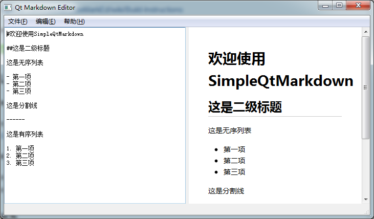

#简单Markdown编辑器

[Hoedown]:https://github.com/hoedown/hoedown
[CuteMarkEd]:https://github.com/cloose/CuteMarkEd

##简介

这是我的选修课结课作业，使用Qt5.2 加[Hoedown]制作

在将[Hoedown]这个C库运用到Qt时遇到了一些麻烦，后来参照[CuteMarkEd]这个非常棒的开源软件解决了问题。

##依赖

- Qt 5.0+
- hoedown

##截图

